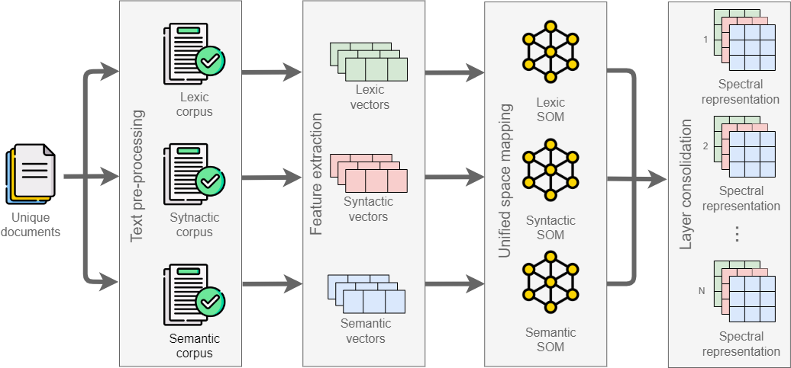

# Spectral Text Representation

[](https://simpsom.readthedocs.io/en/latest/?badge=latest)

<a rel="license" href="http://creativecommons.org/licenses/by-nc/4.0/"></a><br />

This work is licensed under a <a rel="license" href="http://creativecommons.org/licenses/by-nc/4.0/">Creative Commons Attribution-NonCommercial 4.0 International License</a>.

<a id="index"></a>
## Index:
1. [**How does it work**](#work)
   
2. [**Dependencies**](#dependencies)

3. [**Directory Structure**](#directory)

4. [**Example of Usage**](#example)

5. [**Documentation**](#documentation)

6. [**Citation**](#citation)


<a id="work"></a>
## How does it work <small>[[Top](#index)]</small>

This API takes a text and extracts from it the lexical, syntactic, and semantic characteristics so that these values can be the input to train a neural network, for example.

<p align="center">
  
</p>

The API is composed of four main stages:
1. **Text Pre-Processing**: Different pre-processing techniques are applied to the input corpus depending on the layer we work on (lexical, syntactic, or semantic layer). The only common pre-processing task for all layers are converting all text to lowercase and tokenizing it for all layers. From this stage, we obtained three new versions of the corpus, one for each text component.

2. **Feature Extraction**: After this stage, we obtain three feature vectors for the same text (lex, syn, sem) corresponding to each text component. The extraction vectors is as follows:

- Lexical layer: Each entry in the vector corresponds to the amount of information (using Shannon's formula) provided by each word of the vocabulary, including punctuation marks and stop words if desired.

- Syntactic layer:  POS tagging process was applied in the pre-processing stage to obtain a POS tag sequence from the original text. In this way, using the ```Doc2Vec``` algorithm is expected to capture syntactic information about the content  to obtain the vector.

- Semantic layer: We want to obtain feature vectors that capture semantic information. Given this, we resort to the ```Doc2Vec``` algorithm once again to extract the corresponding feature vectors.

3. **Unified Space Mapping** - [SOM](https://github.com/JustGlowing/minisom):  The sets of extracted feature vectors lex,  syn, and sem, can have a different number of dimensions. At this stage, we make use of the ```Self-Organizing Maps (SOM)``` to transfer vectors with a different number of dimensions to a space with the same dimensions where their similarity is preserved.

4. **Layer Consolidation**: This final stage of the text transformation consists only of taking the three spectra of each text to consolidate them into a single three-layer text representation containing lexical, syntactical, and semantic features about the content.


To see in detail how each stage works, go [here](documentation/README.md).

<a id="dependencies"></a>
## Dependencies <small>[[Top](#index)]</small>

Important Dependencies:
```
gensim==4.1.2
pandas==1.4.1
scikit-learn==1.0.2
tensorflow==2.6.0
```

To see all the dependencies used, please consult the [here](requirements.txt) file.

Don't forget to install these dependencies before using the API:
```
pip3 install -r requirements.txt
```

<a id="directory"></a>
## Directory Structure <small>[[Top](#index)]</small>

Finally, we describe the purpose of each directory and what files are contained in each.

* **documentation**: Sphinx documentation of the classes and scripts.
* **minisom**: Python script of Minimalistic implementation of the Self Organizing Maps, Giuseppe Vettigli
* **spectraltrep**: Modules containing the stages implementation of the Spectral Based representation.
* **usage**: Usage example of the spectraltrep modules.
* **requirements.txt**: Python requirements of the spectraltrep modules and documentation generation.

<a id="example"></a>
## Example of Usage <small>[[Top](#index)]</small>

#### By stages

**Preprocessing:**
```
def preProcessStage():
    """Pre-processing stage"""

    print("Pre-processing stage")

    inputPath = '../data/data_sample.jsonl' # input file
    outputPath = 'outputs/Preprocessed.jsonl' # output file
    preProcessingType = ['lex','syn','sem'] # Applicable preprocessing type ['lex', 'syn', 'sem']
    numThreads = 1 # Number of preprocessing threads
    batchSize = 500 # Number of documents delivered by CorpusReader per batch
    sortedOutput = True

    ppf = PreProcessingFacade()
    ppf.preProcess(inputPath, outputPath, preProcessingType, numThreads, batchSize, sortedOutput)

    del(inputPath, outputPath, preProcessingType, numThreads, batchSize, sortedOutput, ppf)

preProcessStage()
```

**Extract vectors (features):**
- Lexical:
    ```
    def featureExtractionStage() -> int:
        cr = CorpusReader('outputs/Preprocessed_lex.jsonl', 500)
        vw = DocumentSink('outputs/LexicVectors.jsonl', False)
        vf = VectorizerFactory()
        lv = vf.createLexicVectorizer(vw, cr)

        lv.fit()
        lv.transform()
        lv.saveModel('outputs/lexicModel.json')
        vw.saveCorpus()

        lexicVectorLenght = lv.model.vocabularyLength

        del(cr, vw, vf, lv)
    ```
- Semantic - Syntactic:
    The process is the same for semantic and syntactic vectors, only the name changes depending on which vector you want, this is indicated in the code as

    ```<Semantic | Syntactic>``` or ```<sem | syn>```
    ```
        cr = Doc2VecCorpusReader('outputs/Preprocessed_<sem | syn>.jsonl')
        vw = DocumentSink('outputs/<Semantic | Syntactic>Vectors.jsonl', False)
        vf = VectorizerFactory()
        sv = vf.create<Semantic | Syntactic>Vectorizer(vw, cr, 300)

        sv.fit()
        sv.transform()
        sv.saveModel('outputs/dv2SemModel')
        vw.saveCorpus()

        del(cr, vw, vf, lv)
    ```

**Unified space mapping:**
- Lexical:
    ```
    def spaceMappingStage(lexicVectorLenght: int):

        vr = VectorReader('outputs/LexicVectors.jsonl')
        proj = Projector(20,lexicVectorLenght,learningRate=0.5) 
        sink = DocumentSink('outputs/LexicSpectra.jsonl', False)

        data = vr.readFeatureVectors()
        proj.fit(data, 1000)
        proj.getProjection(data, sink)
        proj.saveSomModel('outputs/LexicModel.som') 

        del(vr, proj, sink, data, lexicVectorLenght)  
    ```
-  Semantic - Syntactic:
    ```
        vr = VectorReader('outputs/<Semantic | Syntactic>Vectors.jsonl')
        proj = Projector(20,300,learningRate=0.5)
        sink = DocumentSink('outputs/<Semantic | Syntactic>cSpectra.jsonl', False)

        data = vr.readFeatureVectors()
        proj.fit(data, 1000)
        proj.getProjection(data, sink)
        proj.saveSomModel('outputs/<Semantic | Syntactic>Model.som')

        del(vr, proj, sink, data)
    ```

**Layer consolidation**:
```
def layerConsolidation():
    """LayerConsolidation"""

    print("Layer consolidation stage")

    from spectraltrep.layerConsolidation import SpectraAssembler

    assembler = SpectraAssembler("./outputs/FullSpectra.jsonl")
    path = "outputs/"
    assembler.assemble(path+"LexicSpectra.jsonl", path+"SyntacticSpectra.jsonl", path+"SemanticSpectra.jsonl")

    del(assembler, path)

    print("Ensemble finished")
```

[Here](usage/Spectrep.py) the complete example of how to use the API, 
to run the example:
```
cd usage/
mkdir outputs
python3 Spectrep.py
```

<a id="documentation"></a> 
## Documentation <small>[[Top](#index)]</small>

See [here](https://spectrep.readthedocs.io/en/latest/) the full API documentation

<a id="citation"></a> 
## Citation <small>[[Top](#index)]</small>

If using this API, please cite:

> cita
