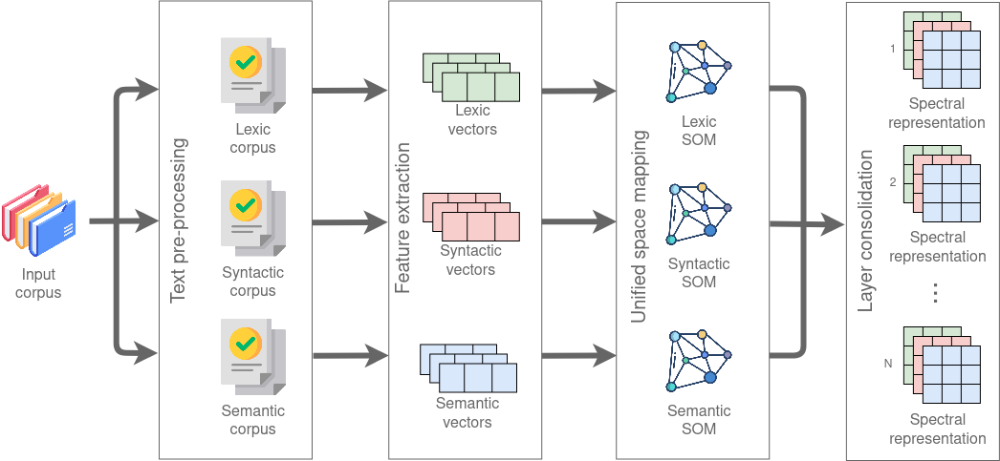

# Spectral Text Representation

[](https://simpsom.readthedocs.io/en/latest/?badge=latest)

<a rel="license" href="http://creativecommons.org/licenses/by-nc/4.0/"></a><br />

This work is licensed under a <a rel="license" href="http://creativecommons.org/licenses/by-nc/4.0/">Creative Commons Attribution-NonCommercial 4.0 International License</a>.

<a id="index"></a>
## Index:
1. [**How does it work**](#work)
   
2. [**Dependencies**](#dependencies)

3. [**Example of Usage**](#example)

4. [**Documentation**](#documentation)

5. [**Citation**](#citation)


<a id="work"></a>
## How does it work <small>[[Top](#index)]</small>

This API takes a text and extracts from it the lexical, syntactic, and semantic characteristics so that these values can be the input to train a neural network, for example.
The API is composed of four main stages:
1. Extract lexical, syntactic, and semantic features
2. Create a vector for each extracted feature
3. Vectors are unified using SOM
4. The outputs of the previous stage are joined, which gives us the spectral representation

<p align="center">
  
</p>

To see in detail what each stage does, go [here](documentation/README.md).

<a id="dependencies"></a>
## Dependencies <small>[[Top](#index)]</small>

Important Dependencies:
```
gensim==4.1.2
pandas==1.4.1
scikit-learn==1.0.2
tensorflow==2.6.0
```

To see all the dependencies used, please consult the [here](requirements.txt) file, 
Don't forget to install these dependencies before using the API:
```
pip3 install -r requirements.txt
```

<a id="example"></a>
## Example of Usage <small>[[Top](#index)]</small>

[Preprocessing](tests/PreProcessingFacade.py):
```
    ppf = PreProcessingFacade()
    ppf.preProcess(inputPath, outputPath, preProcessingType, numThreads, batchSize, sortedOutput)
```

Extract vectors:
- [Lexical](tests/PipelineLexicVectorizerTrain.py):
    ```
    cr = CorpusReader('outputs/panPreprocessed_lex.jsonl', 500)
    vw = DocumentSink('outputs/LexicVectors.jsonl', False)
    vf = VectorizerFactory()
    lv = vf.createLexicVectorizer(vw, cr)
    lv.fit()
    lv.transform()
    lv.saveModel('outputs/lexicModel.json')
    vw.saveCorpus()
    ```
-  [Semantic](tests/PipelineSemanticVectorizerTrain.py) - Syntactic:
    ```
    cr = Doc2VecCorpusReader('outputs/panPreprocessed_<sem | syn>.jsonl')
    vw = DocumentSink('outputs/<Semantic | Syntactic>Vectors.jsonl', False)
    vf = VectorizerFactory()
    sv = vf.create<Semantic | Syntactic>Vectorizer(vw, cr, 300)
    sv.fit()
    sv.transform()
    sv.saveModel('outputs/dv2SemModel')
    vw.saveCorpus()
    ```

Unified space mapping:
- [Lexical](tests/PipelineUnifiedSpace.py):
    ```
    vr = VectorReader('outputs/LexicVectors.jsonl')
    proj = Projector(20,lexicVectorLenght,learningRate=0.5) 
    sink = DocumentSink('outputs/LexicSpectra.jsonl', False)
    data = vr.readFeatureVectors()
    proj.fit(data, 1000)
    proj.getProjection(data, sink)
    proj.saveSomModel('outputs/LexicModel.som')   
    ```
-  [Semantic](tests/PipelineUnifiedSpace.py) - Syntactic:
    ```
    vr = VectorReader('outputs/<Semantic | Syntactic>Vectors.jsonl')
    proj = Projector(20,300,learningRate=0.5)
    sink = DocumentSink('outputs/<Semantic | Syntactic>cSpectra.jsonl', False)
    data = vr.readFeatureVectors()
    proj.fit(data, 1000)
    proj.getProjection(data, sink)
    proj.saveSomModel('outputs/<Semantic | Syntactic>Model.som')
    ```

[Layer consolidation](tests/PipelineLayerConsolidation.py):
```
assembler = SpectraAssembler("./outputs/FullSpectra.jsonl")
path = "outputs/"
assembler.assemble(path+"LexicSpectra.jsonl", path+"SyntacticSpectra.jsonl", path+"SemanticSpectra.jsonl")
```

<a id="documentation"></a> 
## Documentation <small>[[Top](#index)]</small>

See [here](https://simpsom.readthedocs.io/en/latest/) the full API documentation

<a id="citation"></a> 
## Citation <small>[[Top](#index)]</small>

If using this API, please cite:

> cita