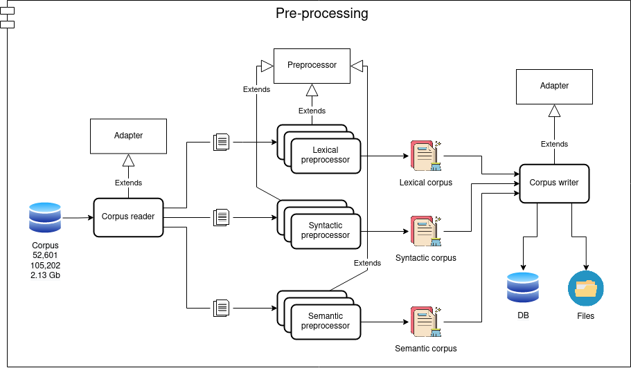
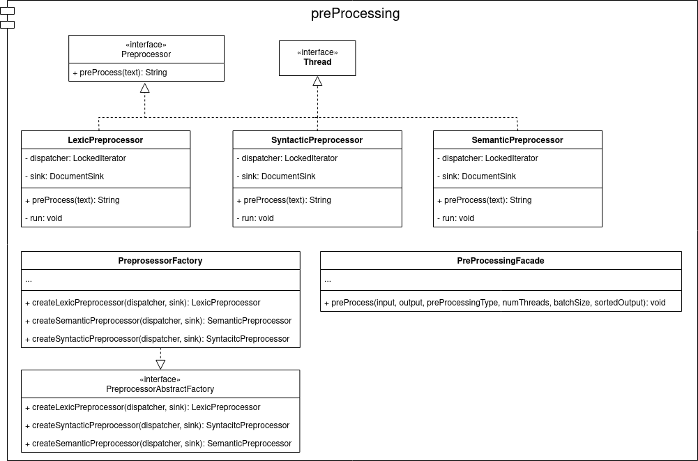
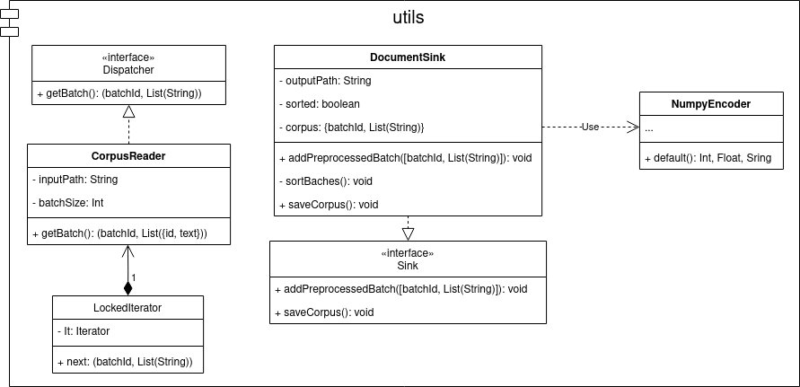
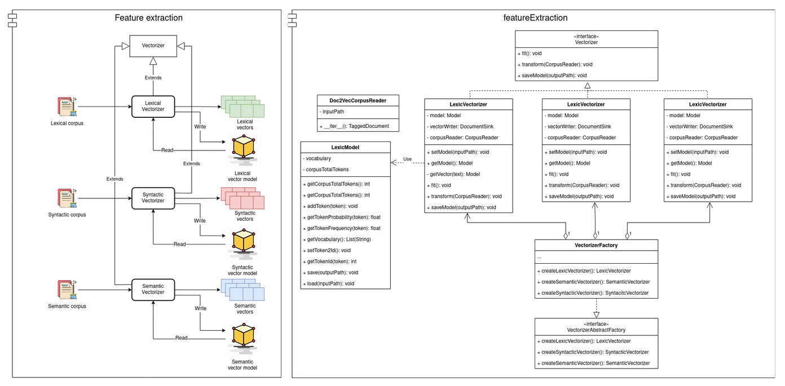
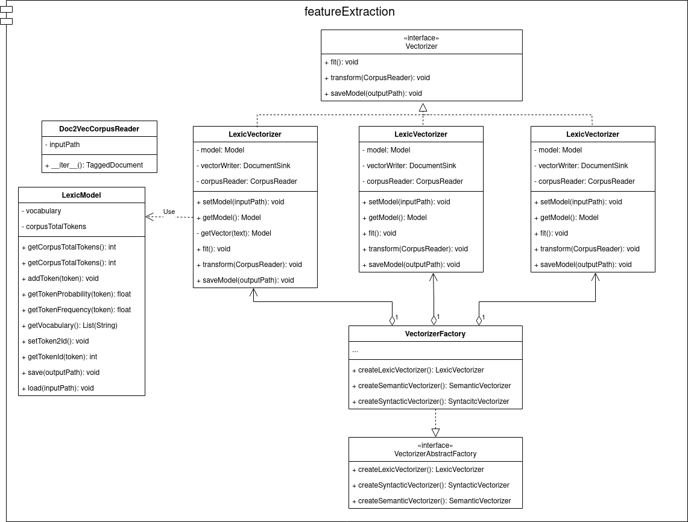
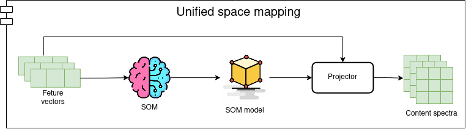
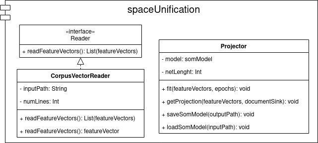
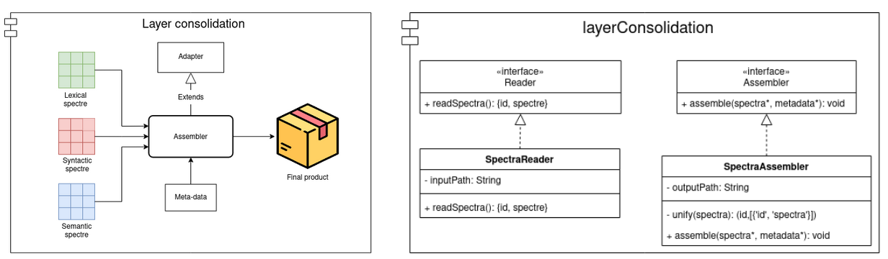
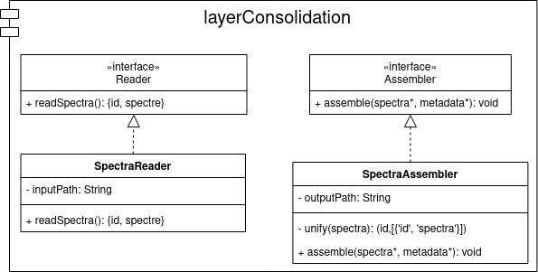

# Spectral Text Representation Documentation

<a id="index"></a>
## Index:
1. [**Documentation**](#documentation)

2. [**Text Pre-Processing Stage**](#preprocessing)
   
3. [**Feature Extraction Stage**](#extraction)

4. [**Unified Space Mapping Stage**](#unifiedSpace)

5. [**Layer Consolidation**](#consolidation)

<a id="documentation"></a>
## Documentation <small>[[Top](#index)]</small>
### Create documentation
```
cd documentation
sphinx-apidoc -o ./_modules ../spectraltrep/
make html
```

### See documentation
```
cd documentation
firefox _build/html/index.html
```

<a id="preprocessing"></a>
## Text Pre-Processing Stage <small>[[Top](#index)]</small>
<p align="center">
  
</p>
<p align="center">
  
</p>
<p align="center">
  
</p>

<a id="extraction"></a>
## Feature Extraction Stage <small>[[Top](#index)]</small>
<p align="center">
  
</p>
<p align="center">
  
</p>

<a id="unifiedSpace"></a>
## Unified Space Mapping Stage <small>[[Top](#index)]</small>
<p align="center">
  
</p>
<p align="center">
  
</p>

<a id="consolidation"></a>
## Layer Consolidation <small>[[Top](#index)]</small>
<p align="center">
  
</p>
<p align="center">
  
</p>