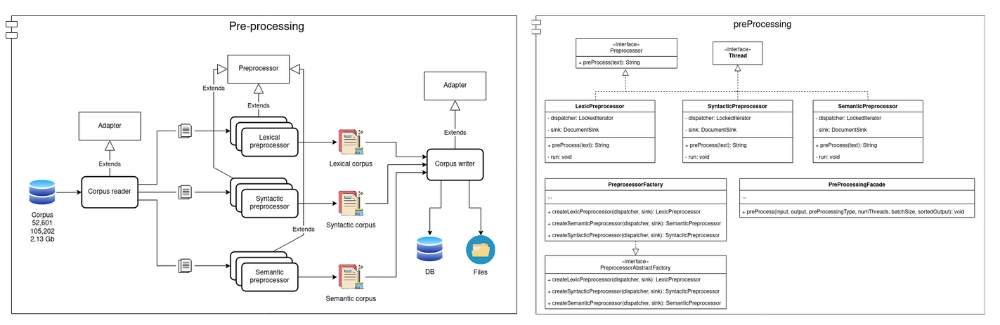

# Spectral Text Representation Documentation

<a id="index"></a>
## Index:

1. [**Utils module**](#utils)

2. [**Text Pre-Processing module**](#preprocessing)
   
3. [**Feature Extraction module**](#extraction)

4. [**Unified Space Mapping module**](#unifiedSpace)

5. [**Layer Consolidation module**](#consolidation)

<!-- <a id="documentation"></a>
## Documentation <small>[[Top](#index)]</small>
### Create documentation
```
cd documentation
sphinx-apidoc -o ./_modules ../spectraltrep/
make html
``` 

### See documentation
```
cd documentation
firefox _build/html/index.html
```
  -->

<p align="center">
  
</p>

<a id="utils"></a>
## Utils module <small>[[Top](#index)]</small>

The utils module contains two classes ```CorpusReader``` and ```DocumentSink``` with their respective interfaces. The first one is in charge of reading the corpus by blocks, since the corpus could be huge and the memory of the computer could not be enough. The second class is in charge of receiving the corpus blocks already pre-processed and here we have two options: saving the blocks as they are received or first receiving all those blocks, ordering them, and finally saving them.

These two classes are used by all other modules to connect them.

<p align="center">
  
</p>

<a id="preprocessing"></a>
## Text Pre-Processing module <small>[[Top](#index)]</small>

For this module, the user only interacts with the PreProcessingFacade class, this class is responsible for reading the corpus with the help of ```CorpusReader()``` found in the ```utils.py``` file, later according to which layers we want (lex, syn, sem) the corresponding preprocessors are created with the help of the ```PreprosessorFactory``` class, where each one makes use of its respective ```LexicPreprocessor```, ```SyntacticPreprocessor``` or ```SemanticPreprocessor```, finally each corpus that results from passing through a Preprocessor is saved using ```DocumentSink()```, which is also found in ```utils.py``` file. 

To carry out this process, it is possible to use threads, since each text within the corpus can be processed independently of other texts within the corpus, even between feature layers, since it is possible to use threads, locks are also used to prevent something wrong with them.

<p align="center">
  
</p>


<a id="extraction"></a>
## Feature Extraction module <small>[[Top](#index)]</small>

We will once again use the ```CorpusReader``` and ```DocumentSink ``` classes from the ```utils.py``` file to read the text that resulted from the preprocessing step and save the vectors once it is finished this stage.

The class that interacts with the user is the ```VectorizerFactory()```, which is in charge of creating the Vectorizers for each layer, in addition to creating or reading the model that results from training the ```Doc2Vec``` network, in the case of the syntactic and semantic layer.

<p align="center">
  
</p>


<a id="unifiedSpace"></a>
## Unified Space Mapping module <small>[[Top](#index)]</small>
The class in charge is called ```Projector``` and this in turn implements the following code [SOM](https://github.com/JustGlowing/minisom).

<p align="center">
  
</p>

<p align="center">
  
</p>

<a id="consolidation"></a>
## Layer Consolidation module<small>[[Top](#index)]</small>

This stage consists of only two classes, the first ```SpectraAssembler```, which takes the three spectra of each text to consolidate them into a single three-layer text representation, which needs the path of all 3 vectors as well as the final route.
The second is the ```SpectraReader``` class, as its name suggests, it returns the full spectrum as ```JSON```.

<p align="center">
  
</p>


